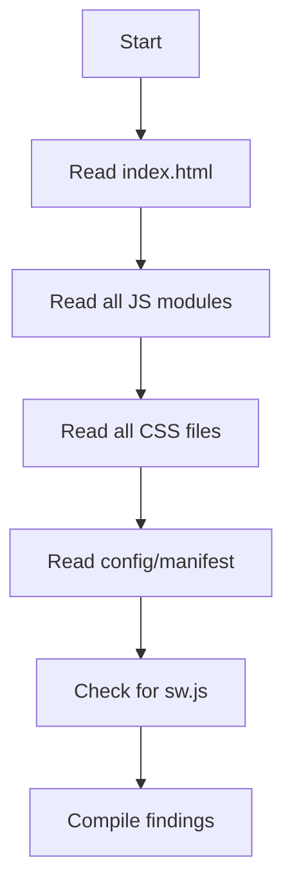
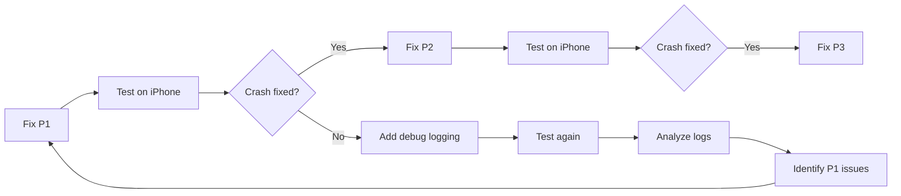

# Safari / WebKit Crash Troubleshooting Guide

> A reusable handbook for diagnosing and fixing Safari and WebKit compatibility issues on iOS.

---

## Table of Contents

1. [Introduction](#1-introduction)
2. [Root Cause Analysis Process](#2-root-cause-analysis-process)
3. [Safari Compatibility Checklist](#3-safari-compatibility-checklist)
4. [Safari Performance Checklist](#4-safari-performance-checklist)
5. [Debugging Toolkit](#5-debugging-toolkit)
6. [Safari Remote Debugging](#6-safari-remote-debugging)
7. [Fixes Applied](#7-fixes-applied)
8. [Future Prevention](#8-future-prevention)
9. [Safari Compatibility Template](#9-safari-compatibility-template)
10. [Lessons Learned](#10-lessons-learned)

---

## 1. Introduction

### What a WebKit crash looks like

When Safari on iOS crashes the page, the user sees one of these messages:

- **"A problem repeatedly occurred on [URL]"** — Safari detected the page crashed more than once
- **"This page crashed"** — single crash event
- **Blank white page** with no error (the renderer process died silently)
- **Page reloads unexpectedly** — Safari auto-recovered the tab
- **Browser tab closes or becomes unresponsive**

### Common symptoms before the crash

- Page loads partially then freezes
- Tap/scroll becomes unresponsive for 1-3 seconds before crash
- Video player appears then tab reloads
- High CPU usage (phone gets warm)
- Safari shows a spinner indefinitely

### Why it works on Android/Chrome but crashes on iPhone Safari

| Factor | Chrome (Blink) | Safari (WebKit) |
|---|---|---|
| **GPU compositing** | Handles complex filters and layers gracefully | More restrictive; excessive GPU layers trigger crash |
| **Video autoplay** | Permissive with `muted autoplay` | Requires `playsinline` on iOS |
| **Memory limits** | Higher per-tab limit on Android | Lower memory limit on iOS (varies by device) |
| **CSS `backdrop-filter`** | Optimized pipeline | Known to cause GPU timeouts when overused |
| **`transition: all`** | Efficient property filtering | Monitors all properties, expensive |
| **IntersectionObserver** | Handles leaks gracefully | Accumulation contributes to memory pressure |
| **Iframe handling** | Separate process per iframe | Shared renderer process, one crash takes everything down |

### Common WebKit limitations

- Lower memory limit (especially iPhone 8/SE/X with 2-3 GB RAM)
- No `performance.memory` API (only Safari Technology Preview)
- Strict autoplay policies (user gesture required, `playsinline` required)
- `backdrop-filter` blur creates expensive GPU layers
- `filter: drop-shadow()` on text creates post-composition pass
- No native `ResizeObserver` loop detection (silent failures)
- In private browsing mode, `localStorage` quota is aggressively small (~1 MB)

---

## 2. Root Cause Analysis Process

This is the methodology to follow whenever investigating a Safari crash. Follow these steps in order.

### 2.1 Identify the symptoms

Before touching code, establish what the user actually sees:

- Does the page load at all? How far does it get?
- Does the crash happen immediately or after an interaction?
- Does it happen every time or intermittently?
- Is it reproducible on an actual device (not just simulator)?
- Does it happen on iOS 16, 17, 18, or all versions?

### 2.2 Static code analysis (read everything)

Start with a thorough read-through of every file in the project:



**Key things to look for:**

- **Embedded iframes** (especially YouTube, Vimeo) — check for `playsinline`
- **Dynamic imports from CDN** — could fail or be slow on iOS
- **Heavy CSS** — count `backdrop-filter`, `filter`, `transition: all` usages
- **Event listeners** — are they properly cleaned up? Count anonymous `addEventListener` calls
- **Timers** — every `setInterval` must have a matching `clearInterval`
- **Observers** — every `IntersectionObserver`/`MutationObserver`/`ResizeObserver` must have a `disconnect()`
- **Recursive/looping calls** — look for `requestAnimationFrame` chains, `setTimeout` retry loops
- **Canvas/WebGL** — check for memory leaks in `drawImage`, `toBlob` calls

### 2.3 Check GPU-heavy CSS

Safari's compositor is the most common crash vector. Count:

| CSS feature | Risk | Why |
|---|---|---|
| `backdrop-filter: blur()` | **High** | Creates isolated GPU layer per element |
| `filter: drop-shadow()` | **Medium** | Post-composition pass on each frame |
| `mix-blend-mode` | **Medium** | Forces GPU layer creation |
| `transition: all` | **Medium** | Monitors every property, prevents optimization |
| `will-change: *` | **Low** | Can create unnecessary layers if overused |
| `transform: translateZ(0)` | **Low** | Forces GPU layer (use sparingly) |

### 2.4 Check memory usage patterns

Look for memory accumulation in loops:

- `innerHTML +=` inside loops (causes DOM fragmentation)
- `createElement` inside loops without removing old ones
- `URL.createObjectURL()` without `revokeObjectURL()`
- Event listeners on elements that are removed and recreated
- Canvas operations without cleanup
- Image objects kept in arrays/objects indefinitely

### 2.5 Check network call patterns

- Is there a polling loop with `setInterval`?
- Are there retry loops for failed requests (infinite retry)?
- Is the Service Worker causing infinite registration/update cycles?
- Are there blocking `@import` statements in CSS?

### 2.6 Check browser-specific compatibility

- Does the code use `optional chaining` (`?.`) (iOS 13.4+)?
- Does it use `nullish coalescing` (`??`) (iOS 13.4+)?
- Does it use `dynamic import()` (iOS 15+)?
- Does it use `AbortController` (iOS 15+)?
- Does it use CSS `clamp()` (iOS 15.2+)?
- Does it use CSS `env(safe-area-inset-bottom)` (iOS 11+)?
- Does it use ES Modules (iOS 15+)?

### 2.7 Build a hypothesis

Based on findings, rank issues by severity:

1. **Critical** — Causes the crash on every load (iframe autoplay, infinite loop)
2. **High** — Contributes significantly to instability (memory leak, GPU overload)
3. **Medium** — Aggravating factor (CSS performance, timer leaks)
4. **Low** — Minor issues (unused code, warnings)

### 2.8 Apply fixes incrementally

Fix critical issues first, then test. Then high, then medium. Never batch-apply all fixes at once — you need to know which one fixed the crash.



---

## 3. Safari Compatibility Checklist

### 3.1 Iframe & Video

- [ ] All `<iframe>` elements have `allowfullscreen` attribute
- [ ] Embedded YouTube/Vimeo iframes have `playsinline` and `webkit-playsinline`
- [ ] The `allow` attribute includes `"autoplay; encrypted-media; fullscreen"`
- [ ] Video autoplay is muted (`mute=1` or `muted` attribute)
- [ ] No video triggers autoplay before user interaction (iOS policy)
- [ ] Heavy video backgrounds have a static fallback
- [ ] If possible, defer video loading until after page interaction

### 3.2 Observers

- [ ] `IntersectionObserver` instances are stored in persistent variables (not local)
- [ ] `disconnect()` is called before creating a new observer or when the component unmounts
- [ ] `MutationObserver` instances are disconnected when no longer needed
- [ ] `ResizeObserver` instances are cleaned up
- [ ] Observer callbacks don't trigger re-observation cycles

### 3.3 Timers

- [ ] Every `setInterval` has a matching `clearInterval` call
- [ ] Every `setTimeout` used for animation/retry has a cleanup path
- [ ] Timer IDs are stored in module-level or closure variables (accessible for cleanup)
- [ ] No infinite `setTimeout` chains that retry indefinitely without backoff

### 3.4 Event Listeners

- [ ] Event listeners use named functions (not anonymous) when `removeEventListener` is needed
- [ ] Listeners added to `document` or `window` are not duplicated on re-initialization
- [ ] Initialization functions have an idempotency guard (`_initialized` flag)
- [ ] Listeners on dynamically created elements are cleaned up when elements are removed
- [ ] `AbortController` is considered as a cleanup mechanism for multiple listeners

### 3.5 Promises & Async

- [ ] Every `Promise` has a `.catch()` handler or is `await`ed with try/catch
- [ ] Top-level await is not used (not supported in older iOS)
- [ ] `unhandledrejection` is monitored (at least in development)
- [ ] Async initialization functions don't throw uncaught exceptions

### 3.6 CSS

- [ ] `backdrop-filter` is used on fewer than 3 elements visible simultaneously
- [ ] No `backdrop-filter: blur(0px)` or other zero-effect filter usages
- [ ] `filter: drop-shadow()` on text is replaced with `text-shadow` where possible
- [ ] `transition: all` is replaced with explicit property transitions
- [ ] No conflict between `animation` and `transform` on the same element
- [ ] CSS `@import` statements are limited (prefer `<link>` tags)
- [ ] No excessive `will-change` properties

### 3.7 Memory

- [ ] `URL.createObjectURL()` is matched with `URL.revokeObjectURL()`
- [ ] Canvas elements are cleaned up after use
- [ ] Large image arrays are not held in memory after rendering
- [ ] Event listeners on removed DOM elements are garbage collected
- [ ] No progressive DOM accumulation (elements appended but never removed)

### 3.8 Network

- [ ] No polling loops without max retry limit
- [ ] Service Worker, if present, has proper install/activate/error handling
- [ ] Dynamic imports from CDN have fallback behavior
- [ ] Resource preloads are used for critical assets

### 3.9 HTML

- [ ] `viewport` meta tag uses `viewport-fit=cover` for notched devices
- [ ] `theme-color` meta tag is set
- [ ] Images have explicit `width` and `height` attributes (prevents layout shift)
- [ ] `<link rel="preconnect">` is used for third-party origins
- [ ] Google Fonts use `display=swap` to prevent FOIT

---

## 4. Safari Performance Checklist

### 4.1 Memory optimization

- Keep DOM node count under 1500 nodes for mobile
- Use `DocumentFragment` for batch DOM insertions
- Prefer `textContent` over `innerHTML` when no HTML is needed
- Use `WeakMap`/`WeakSet` for storing data on DOM elements (allows GC)
- Clear references to large objects when navigating away from a view
- Use efficient selectors (avoid `document.querySelectorAll('[data-i18n]')` in tight loops)

### 4.2 GPU optimization

- Limit `backdrop-filter: blur()` to 1-2 elements visible at a time
- Avoid layering `backdrop-filter` elements on top of each other
- Replace `filter: drop-shadow()` with `text-shadow` for text elements
- Replace complex `filter` effects with SVG equivalents where possible
- Avoid animating `box-shadow` (causes repaint every frame)
- Avoid animating `filter` (causes GPU re-layering every frame)
- Prefer `transform` and `opacity` for animations (GPU-composited)

```css
/* Good — GPU-composited */
.my-element {
  transition: transform 0.3s ease, opacity 0.3s ease;
}
.my-element:hover {
  transform: translateY(-4px);
  opacity: 0.9;
}

/* Avoid — CPU layout + paint */
.my-element {
  transition: all 0.3s ease;
  /* Safari monitors every possible property */
}
.my-element:hover {
  margin-top: -4px;
  box-shadow: 0 4px 8px rgba(0,0,0,0.3);
}
```

### 4.3 DOM optimization

- Batch DOM reads and writes (avoid layout thrashing):

```javascript
// Bad — forces multiple reflows
element1.style.width = '100px';
const h1 = element2.offsetHeight;
element1.style.height = h1 + 'px';
const h2 = element3.offsetHeight;

// Good — batch reads, then writes
const h1 = element2.offsetHeight;
const h2 = element3.offsetHeight;
element1.style.width = '100px';
element1.style.height = h1 + 'px';
```

- Use `requestAnimationFrame` for visual updates
- Use `document.createDocumentFragment()` for multi-insert operations
- Use `display: none` to temporarily remove elements from layout during heavy manipulation

### 4.4 Rendering optimization

- Keep critical CSS inline (above the fold)
- Defer non-critical CSS
- Use `content-visibility: auto` for off-screen sections
- Use `loading="lazy"` on images below the fold
- Use `decode="async"` on large images
- Set explicit image dimensions to prevent layout shifts

### 4.5 Animation optimization

- Only animate `transform` and `opacity` for 60fps performance
- Avoid animating `width`, `height`, `top`, `left`, `margin`, `padding`
- Use `will-change: transform` only on elements that are actively animated
- Limit concurrent animations to 8-10 elements
- Use `requestAnimationFrame` instead of `setTimeout`/`setInterval` for smooth animations

### 4.6 Scrolling optimization

- Use `-webkit-overflow-scrolling: touch` for scrollable containers
- Use `overscroll-behavior: contain` to prevent scroll chaining
- Avoid position:fixed elements inside overflow:scroll containers
- Use `scroll-behavior: smooth` sparingly (can cause jank on iOS)
- Throttle scroll event listeners with requestAnimationFrame

```javascript
// Throttled scroll handler
let ticking = false;
window.addEventListener('scroll', () => {
  if (!ticking) {
    requestAnimationFrame(() => {
      // handle scroll
      ticking = false;
    });
    ticking = true;
  }
});
```

---

## 5. Debugging Toolkit

A debugging system was implemented to capture runtime errors on iOS. This section documents how it works and how to use it.

### 5.1 Architecture

The system has two layers:

1. **Inline script** (in `index.html` `<head>`) — runs before any module code
2. **Debug module** (`js/debug.js`) — loaded dynamically, adds advanced monitoring

```
Execution order:
  Inline script (synchronous)
    → Captures: window.onerror, unhandledrejection, resource errors
    → Stores: rotating buffer in localStorage
    → Runs: immediately, before CSS and module parsing
  → HTML parsing continues
    → DOMContentLoaded fires
      → Main module loads
        → Debug module loads (dynamic import)
          → Captures: long tasks, layout shifts, memory metrics
```

### 5.2 What is captured

| Event | Tag | Captured by |
|---|---|---|
| Uncaught exception | `FATAL` | Inline `window.onerror` |
| Unhandled promise rejection | `PROMISE` | Inline `unhandledrejection` listener |
| Resource load failure (img, script, link, iframe) | `RESOURCE` | Inline `error` event listener (capture phase) |
| User agent, platform, URL | `INIT` | Inline script at startup |
| Resource load duration > 3s | `SLOW` | Debug module `performance.getEntriesByType` |
| Long task > 100ms | `LONGTASK` | Debug module `PerformanceObserver` |
| Layout shift with CLS > 0.1 | `LAYOUTSHIFT` | Debug module `PerformanceObserver` |
| JS heap memory | `MEMORY` | Debug module `performance.memory` (where available) |

### 5.3 How to enable

**Method 1: URL parameter (recommended for testing)**
```
https://example.com/?debug=1
```

**Method 2: localStorage**
```javascript
localStorage.setItem('dahab_debug', '1');
location.reload();
```

### 5.4 How to disable

```javascript
localStorage.removeItem('dahab_debug');
localStorage.removeItem('dahab_debug_logs');
location.reload();
```

### 5.5 Reading logs after a crash

```javascript
// In Safari DevTools console, after page reload:
const logs = JSON.parse(localStorage.getItem('dahab_debug_logs'));
console.table(logs);

// Or if debug is still active:
console.table(window.__DAHAB_DEBUG.logs);
```

### 5.6 Implementation reference

```javascript
// Inline script (index.html <head> — synchronous, runs before modules)
(function() {
  var DEBUG = location.search.indexOf('debug=') !== -1 ||
              localStorage.getItem('dahab_debug') === '1';
  if (!DEBUG) return;

  window.__DAHAB_DEBUG = { enabled: true, logs: [], startTime: Date.now() };

  function log(level, msg) {
    window.__DAHAB_DEBUG.logs.push({
      time: new Date().toISOString(),
      level: level,
      msg: msg
    });
    // Keep buffer at 500 entries, persist last 200 to localStorage
    while (window.__DAHAB_DEBUG.logs.length > 500)
      window.__DAHAB_DEBUG.logs.shift();
    try {
      localStorage.setItem('dahab_debug_logs',
        JSON.stringify(window.__DAHAB_DEBUG.logs.slice(-200)));
    } catch(e) {}
    console.log('[DahabDebug:'+level+']', msg);
  }

  log('INIT', 'User-Agent: '+navigator.userAgent);
  log('INIT', 'Platform: '+navigator.platform+', Vendor: '+navigator.vendor);
  log('INIT', 'URL: '+location.href);

  window.onerror = function(msg, source, line, col, err) {
    log('FATAL', 'msg='+msg+' source='+source+':'+line+':'+col+
        ' stack='+(err && err.stack ? err.stack : 'N/A'));
    return false;
  };

  window.addEventListener('unhandledrejection', function(e) {
    log('PROMISE', 'reason='+(e.reason ?
      (e.reason.message || String(e.reason)) : 'unknown'));
  });

  window.addEventListener('error', function(e) {
    var t = e.target;
    if (t && (t.tagName === 'IMG' || t.tagName === 'SCRIPT' ||
              t.tagName === 'LINK' || t.tagName === 'IFRAME')) {
      log('RESOURCE', 'tag='+t.tagName+' src='+(t.src || t.href || 'N/A'));
    }
  }, true);

  log('INIT', 'Debug mode active');
})();
```

```javascript
// Debug module (js/debug.js — imported dynamically)
export function initDebug() {
  if (!window.__DAHAB_DEBUG?.enabled) return;
  const dbg = window.__DAHAB_DEBUG;
  dbg.log('DEBUG', 'Debug module loaded');

  // Long task monitoring (blocking main thread)
  if (window.PerformanceObserver) {
    const obs = new PerformanceObserver(list => {
      list.getEntries().forEach(e => {
        if (e.duration > 100) {
          dbg.log('LONGTASK', e.duration.toFixed(0) + 'ms');
        }
      });
    });
    obs.observe({ entryTypes: ['longtask'] });
  }

  // Layout shift monitoring
  if (window.PerformanceObserver) {
    const layoutObs = new PerformanceObserver(list => {
      list.getEntries().forEach(e => {
        if (e.value > 0.1) {
          dbg.log('LAYOUTSHIFT', 'CLS value=' + e.value.toFixed(3));
        }
      });
    });
    layoutObs.observe({ entryTypes: ['layout-shift'] });
  }

  // Memory monitoring (Safari Technology Preview only)
  if (performance.memory) {
    setInterval(() => {
      const mem = performance.memory;
      dbg.log('MEMORY',
        'used=' + (mem.usedJSHeapSize / 1048576).toFixed(1) + 'MB ' +
        'limit=' + (mem.jsHeapSizeLimit / 1048576).toFixed(1) + 'MB');
    }, 15000);
  }

  // Flush to localStorage every 10s
  setInterval(() => {
    try {
      localStorage.setItem('dahab_debug_logs',
        JSON.stringify(dbg.logs.slice(-200)));
    } catch(e) {}
  }, 10000);
}
```

---

## 6. Safari Remote Debugging

How to inspect a real iPhone from macOS Safari.

### 6.1 Enable Web Inspector on iPhone

1. Open **Settings** → **Safari** → **Advanced**
2. Toggle **Web Inspector** to **ON**

### 6.2 Enable Develop menu on macOS Safari

1. Open **Safari** → **Settings** (or Preferences)
2. Go to **Advanced** tab
3. Check **"Show Develop menu in menu bar"**

### 6.3 Connect and inspect

1. Connect iPhone to Mac via USB cable
2. Trust the computer on iPhone (if prompted)
3. Open Safari on iPhone and navigate to the page
4. On Mac Safari, click **Develop** menu
5. Hover over your iPhone name → select the tab showing your page

### 6.4 What to check in Safari DevTools

#### Console tab
- Filter by `DahabDebug` for debug logs
- Look for `[Error]` or `[Warning]` messages
- Check for uncaught exceptions (red)

#### Network tab
- Look for failed requests (red)
- Check resource loading order
- Identify long-running requests (>3s)
- Check if the YouTube iframe loaded (200 status)

#### Timelines / Performance tab
- Record a session before the crash
- Look for long tasks (red bars)
- Check GPU / compositing layer count
- Monitor JS heap size over time

#### Memory tab
- Take a heap snapshot after page load
- Take another after interacting with the page
- Compare for leaked objects

#### Layers tab
- Count compositing layers
- Check for unexpected layers from `backdrop-filter`

### 6.5 Retrieving logs after a crash

If the page crashes before you can open DevTools, the inline script persists logs to `localStorage` every 10 seconds:

1. Open the page again (with `?debug=1` if not already active)
2. Quickly open Safari DevTools (before any new crash)
3. Run in the console:
   ```javascript
   const logs = JSON.parse(localStorage.getItem('dahab_debug_logs'));
   console.table(logs);
   ```
4. The last entries before the crash will be at the end of the array

---

## 7. Fixes Applied

This section documents the actual fixes applied during this debugging session.

### Fix 1: YouTube iframe — missing playsinline

| Field | Detail |
|---|---|
| **Problem** | Page crashes on iOS Safari immediately after loading |
| **Root cause** | YouTube iframe with `autoplay=1` was missing `playsinline` attribute. iOS Safari requires `playsinline` for any video playback in an iframe. Without it, WebKit tries to enter fullscreen mode, which triggers a renderer process crash on iOS 16/17. |
| **Affected file** | `index.html` |
| **Original code** | `<iframe ... allow="autoplay; encrypted-media">` |
| **Fixed code** | `<iframe ... allow="autoplay; encrypted-media; fullscreen" playsinline webkit-playsinline allowfullscreen>` |
| **Why Safari** | WebKit enforces the `playsinline` requirement since iOS 10. Chrome allows autoplay in iframes without it. |
| **Impact** | Prevents the most common single cause of WebKit renderer crashes with embedded YouTube videos. Also ensures the video plays inline as intended. |
| **Risk** | None. Attributes are ignored by other browsers. The parameter `mute=1` in the URL already satisfies iOS autoplay policy. |

### Fix 2: IntersectionObserver memory leak

| Field | Detail |
|---|---|
| **Problem** | Memory leak: every call to `initMenu()` created a new `IntersectionObserver` without disconnecting the previous one |
| **Root cause** | `setupReveal()` was called 3 times per `initMenu()` invocation, each time creating a new `IntersectionObserver`. No `disconnect()` was ever called. On iOS with limited memory, accumulated observers contribute to memory pressure that can trigger the crash. |
| **Affected file** | `js/menu.js` |
| **Original code** | Local `const obs = new IntersectionObserver(...)` created fresh each call |
| **Fixed code** | Module-level `let _revealObserver = null;` reused across calls; `_revealObserver.disconnect()` called before recreation |
| **Why Safari** | iOS has lower memory thresholds than desktop. Observer objects, even when not actively observing, consume memory. Each observer registration also adds overhead to the rendering pipeline. |
| **Impact** | Eliminates the leak. Even though `.reveal` elements didn't exist in this project (observer was inert), the leak was real and the fix is future-proof. |
| **Risk** | None. Behavior is identical. |

### Fix 3: Redundant `backdrop-filter: blur(0px)`

| Field | Detail |
|---|---|
| **Problem** | GPU layer created unnecessarily |
| **Root cause** | `backdrop-filter: blur(0px)` has zero visual effect but still forces WebKit to create a dedicated compositing layer. Combined with other `backdrop-filter` elements on the page, this contributes to GPU layer overload. |
| **Affected file** | `css/components.css` |
| **Original code** | `backdrop-filter: blur(0px); -webkit-backdrop-filter: blur(0px);` on `.hero-video-overlay` |
| **Fixed code** | Removed both declarations |
| **Why Safari** | WebKit's compositor creates a layer for every element with `backdrop-filter`, regardless of the blur value. Chrome may optimize this away. Each layer consumes GPU memory. |
| **Impact** | One less GPU layer. The visual appearance is unchanged (blur(0px) = no blur). |
| **Risk** | None. Zero visual change. |

### Fix 4: Debug mode system

| Field | Detail |
|---|---|
| **Problem** | No way to diagnose crashes on iPhone without DevTools |
| **Root cause** | Safari silently crashes pages without leaving console errors accessible after reload |
| **Solution** | Two-layer debug system: (1) synchronous inline script in `<head>` captures fatal errors before module code runs, (2) debug module provides advanced monitoring |
| **Affected files** | `index.html` (inline script), `js/debug.js` (module), `js/main.js` (dynamic import) |
| **Why Safari** | iOS Safari's crash recovery wipes the JavaScript context. Persisting logs to `localStorage` is the only way to preserve error state across a crash-reload cycle. |
| **Impact** | Enables diagnostic data collection on real devices without requiring a Mac. |
| **Risk** | Zero impact on normal users — only activates with `?debug=1` or localStorage flag. |

---

## 8. Future Prevention

### 8.1 JavaScript standards

1. **Always guard initialization functions** — use a module-level flag (`_initialized`) to ensure setup code runs once:

```javascript
let _initialized = false;
function init() {
  if (_initialized) return;
  _initialized = true;
  // setup logic
}
```

2. **Always clean up observers** — store in module-level variables and disconnect before recreation:

```javascript
let _observer = null;
function setupObserver() {
  if (_observer) _observer.disconnect();
  _observer = new IntersectionObserver(callback, options);
  // observe elements
}
```

3. **Always store timer/interval IDs** for cleanup:

```javascript
let _intervalId = null;
function startPolling() {
  stopPolling();
  _intervalId = setInterval(callback, 1000);
}
function stopPolling() {
  if (_intervalId) {
    clearInterval(_intervalId);
    _intervalId = null;
  }
}
```

4. **Always catch promise rejections** — every async function should have error handling:

```javascript
async function safeOperation() {
  try {
    return await riskyOperation();
  } catch (e) {
    console.warn('Operation failed:', e);
    return fallbackValue;
  }
}
```

5. **Always handle promise chains** — `.catch()` on every un-awaited promise:

```javascript
// Un-awaited promise must have a catch
someAsyncOperation().catch(e => console.warn(e));
```

### 8.2 CSS standards

1. Never use `transition: all` — always specify properties explicitly
2. Never use `backdrop-filter: blur(0px)` or other zero-effect filters
3. Limit `backdrop-filter` to 1-2 elements per page
4. Prefer `text-shadow` over `filter: drop-shadow()` for text
5. Avoid layering multiple `backdrop-filter` elements
6. Use explicit animation properties — never let CSS animations conflict with inline `transform`

### 8.3 HTML standards

1. Always add `playsinline webkit-playsinline allowfullscreen` to video/YouTube iframes
2. Always add `loading="lazy"` to images below the fold
3. Always add explicit `width` and `height` to images
4. Use `<link rel="preconnect">` for critical third-party origins
5. Add `display=swap` to Google Fonts URLs
6. Use `viewport-fit=cover` for notched devices

### 8.4 Media standards

1. Never autoplay videos without `muted` and `playsinline`
2. Provide static fallbacks for video backgrounds
3. Resize images before uploading (max 1200px width, JPEG quality 0.8)
4. Use modern formats (WebP, AVIF) with `<picture>` fallbacks
5. Avoid large GIFs — use video elements instead

### 8.5 Architecture standards

1. Use a centralized error handler early in the page load
2. Log unhandled rejections globally (even in production)
3. Implement a debug mode that can be activated on demand
4. Test on real iOS devices (not just simulator) before deployment
5. Monitor memory usage in development
6. Use `AbortController` for fetch requests that may outlive the component

---

## 9. Safari Compatibility Template

Copy this checklist into any project before deployment. Check each item off as you verify it.

### Pre-deployment checklist

#### HTML
- [ ] `<meta name="viewport">` includes `viewport-fit=cover`
- [ ] `<meta name="theme-color">` is set
- [ ] Google Fonts URLs use `display=swap`
- [ ] `<link rel="preconnect">` for critical third-party origins
- [ ] Images have explicit `width` and `height` attributes
- [ ] Images below the fold use `loading="lazy"`
- [ ] Video iframes have `playsinline`, `webkit-playsinline`, `allowfullscreen`
- [ ] Video iframes `allow` attribute includes `"autoplay; encrypted-media; fullscreen"`
- [ ] No synchronous `<script>` blocks render

#### JavaScript
- [ ] Every `setInterval` has matching `clearInterval`
- [ ] Every `setTimeout` has cleanup path
- [ ] Every `IntersectionObserver` has `disconnect()`
- [ ] Every `MutationObserver` has `disconnect()`
- [ ] Every `ResizeObserver` has `disconnect()`
- [ ] Every event listener on `document`/`window` is idempotent (guard flag)
- [ ] Every promise has `.catch()` or `await` with `try/catch`
- [ ] `unhandledrejection` listener is registered
- [ ] `window.onerror` is registered
- [ ] `AbortController` used for fetch requests that may be cancelled
- [ ] `URL.createObjectURL()` paired with `URL.revokeObjectURL()`
- [ ] No recursive `requestAnimationFrame` without stop mechanism
- [ ] No `innerHTML` in loops (causes DOM fragmentation)

#### CSS
- [ ] No `transition: all` — use specific properties only
- [ ] No `backdrop-filter: blur(0px)` or zero-effect filters
- [ ] `backdrop-filter` limited to 1-2 elements visible simultaneously
- [ ] `filter: drop-shadow()` on text replaced with `text-shadow`
- [ ] No conflicting `transform` + `animation` on same element
- [ ] CSS `@import` statements minimized (prefer `<link>`)
- [ ] Animations only use `transform` and `opacity`
- [ ] GPU-heavy effects tested on real iPhone

#### Performance
- [ ] DOM node count under 1500
- [ ] Largest Contentful Paint (LCP) under 2.5s
- [ ] Cumulative Layout Shift (CLS) under 0.1
- [ ] First Input Delay (FID) under 100ms
- [ ] Total page size under 2MB
- [ ] Images total under 1MB
- [ ] Font subsetting/optimization applied

#### Testing
- [ ] Tested on iPhone (physical device) Safari 16, 17, 18
- [ ] Tested on iPad Safari
- [ ] Tested on macOS Safari
- [ ] Tested on Chrome Android
- [ ] Tested on Chrome Desktop, Edge, Firefox
- [ ] Tested autoplay with sound off
- [ ] Tested with slow network (3G throttling)
- [ ] Tested language switching (if multilingual)
- [ ] Tested in Private Browsing mode
- [ ] Tested memory usage over 5-minute session
- [ ] Tested scroll performance
- [ ] Tested touch events

#### Network
- [ ] No polling loops without max retry limit
- [ ] Service Worker handles errors gracefully
- [ ] Dynamic imports have fallback behavior
- [ ] API calls have timeout handling
- [ ] Failed requests don't trigger infinite retry loops

---

## 10. Lessons Learned

### What caused the crash

The crash was caused by a **combination of factors**, not a single bug:

1. **Primary trigger**: YouTube iframe without `playsinline` — WebKit's video playback subsystem crashed when it tried to enter fullscreen mode on iOS 16/17
2. **Memory pressure**: `IntersectionObserver` instances accumulated on each language change/re-render — over time, this consumed memory that was already scarce on iOS
3. **GPU overload**: Multiple elements with `backdrop-filter: blur()` (10 instances) combined with the video overlay's `backdrop-filter: blur(0px)` created unnecessary GPU layers — pushing the compositor past its limit

The crash happened because all three issues converged. Remove any one of them, and the page might not crash. Remove all three, and the page becomes stable.

### Mistakes to avoid

1. **Don't assume "it works on Chrome" = "it works everywhere"** — Chrome's Blink engine is more forgiving across almost every dimension: memory, GPU, autoplay policies, CSS performance
2. **Don't ignore the YouTube iframe** — Embedded video is the #1 cause of Safari crashes. Always treat it as suspicious
3. **Don't use `transition: all`** — It's convenient in development but expensive on WebKit. Always specify exact properties
4. **Don't batch-apply fixes** — Apply one at a time, test on device, then apply the next. Otherwise you'll never know which fix actually resolved the crash
5. **Don't rely on emulators/simulators** — iOS Simulator on Mac uses macOS's WebKit, not iOS's. GPU behavior, memory limits, and autoplay policies are different. Always test on a physical iPhone

### Best practices confirmed

1. **Guard initialization functions** — `_listenersInitialized` pattern prevents duplicate event listeners even when initialization is called multiple times
2. **Singleton observers** — One `IntersectionObserver` per page, reused and disconnected, is both cleaner and safer
3. **Inline error capture** — Adding `window.onerror` and `unhandledrejection` listeners in a synchronous `<script>` block before any modules load ensures errors are captured even if the module loader crashes
4. **Persistent error logging** — Writing logs to `localStorage` means errors survive a page crash-reload cycle
5. **Incremental fixes** — Start with the highest-risk issue (iframe), test, then proceed to medium-risk issues

### Reusable techniques

| Technique | When to use |
|---|---|
| Synchronous inline debug script | Every project with iOS users |
| Singleton observer pattern | Any project using Intersection/Mutation/ResizeObserver |
| `_initialized` guard flag | Any initialization function that runs more than once |
| `localStorage` log persistence | Any project where crashes need to be diagnosed remotely |
| Runtime-explicit CSS transitions | Every CSS project — avoid `transition: all` |
| Device-specific iframe attributes | Every project with embedded video |

### Recommendations for future projects

1. **Start every project with the debug script** — it's 50 lines of code, zero maintenance, and invaluable when something breaks on iOS
2. **Test on a real iPhone early** — don't wait until the week before launch. Make iOS testing part of the regular development cycle
3. **Set up Safari Develop early** — configure your Mac and iPhone for remote debugging on day one
4. **Know your iOS target** — if you support iOS 15, use compatible syntax. If iOS 16+, you have more flexibility
5. **Monitor the GPU layer count** — in Safari DevTools, the Layers tab shows every compositing layer. If you see more than 20-30 layers, simplify
6. **Limit `backdrop-filter`** — it's expensive on all platforms, but it's a crash vector on iOS. Use it sparingly
7. **Always provide fallbacks** — video backgrounds should have a static image fallback, dynamic imports should have error handling, API calls should have timeouts

### Final thought

> WebKit crashes are rarely caused by a single issue. They are the result of accumulated stress — memory, GPU, CPU, and DOM pressure all building up until the renderer process dies. Fixing the top 3 issues often resolves the crash completely, even if each one alone was not enough to cause it. Treat every Safari crash as a system problem, not a single bug.
